# Gravity-Bookstore-Data-Warehouse  

End-to-end Data Warehouse project for **Gravity Bookstore** using SQL Server, Snowflake Schema, SSIS ETL with incremental load, SCD Type 2 (Lookup + Conditional Split), data cleansing, and Power BI dashboards.  

---

## 1. Project Overview  

The goal of this project is to build a **Data Warehouse (DWH)** for Gravity Bookstore that consolidates operational data into an analytical model, enabling insights into customers, sales, books, authors, shipping, and order history.  

### Objectives  
- **Centralized Storage:** Combine OLTP bookstore data into a Snowflake schema.  
- **ETL:** Build an SSIS pipeline with incremental load and SCD management.  
- **Historical Tracking:** Implement Slowly Changing Dimensions (SCD Type 1 & 2).  
- **Analytics Ready:** Provide clean, structured data for Power BI dashboards.  

---

## 2. Project Architecture & Technologies  

### 2.1 Architecture  
The solution follows a **Snowflake schema** and a layered DWH architecture:  

- **Source Layer:** Gravity Bookstore OLTP system.  
- **ETL Layer:** SSIS packages for extraction, transformation, and loading.  
- **Data Warehouse Layer:** SQL Server-based Snowflake schema with fact & dimension tables.  
- **Analytics Layer:** Power BI dashboards for business reporting.  

 

### 2.2 Technologies Used  
- **Database:** SQL Server  
- **ETL Tool:** SSIS (with incremental load + SCD logic)  
- **Modeling:** Snowflake schema  
- **Visualization:** Power BI  
- **Scripting:** T-SQL for DDL and incremental logic  

---

## 3. Data Source  

The source is an **OLTP relational database** designed for bookstore operations.  

Key entities in the ERD:  
- **Book & Publisher:** Titles, ISBN, pages, publication date, language, publisher.  
- **Author & Book_Author:** Many-to-many mapping between books and authors.  
- **Customer & Customer_Address:** Customers with multiple addresses and statuses.  
- **Address & Country:** Normalized address hierarchy.  
- **Orders & Order_Lines:** Customer purchases and details of each book sold.  
- **Shipping_Method:** Delivery options with cost.  
- **Order_History & Status:** Tracks the lifecycle of an order.  

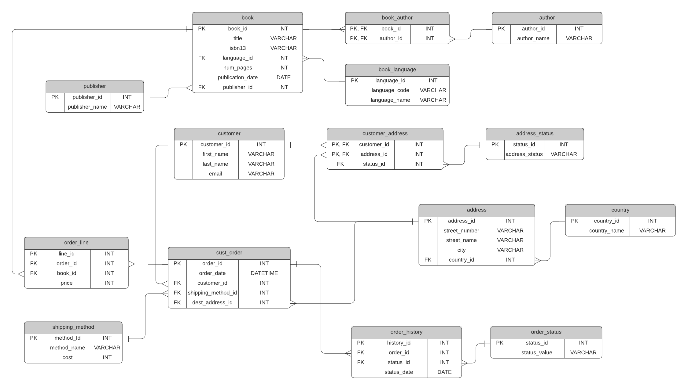 

---

## 4. Data Warehouse Modeling  

The OLTP schema was transformed into a **Snowflake DWH schema**.  

### 4.1 Dimensions  
- **dim_customer:** Customer attributes with SCD2 history.  
- **dim_book:** Book attributes + publisher + language.  
- **dim_author:** Author details.  
- **dim_address:** Address + country + status with SCD2 history.  
- **dim_shipping_method:** Shipping methods with SCD2 history.  
- **dim_order_history_status:** Order status with date/time.  

### 4.2 Bridge Tables  
- **bridge_book_author:** Resolves many-to-many between books and authors.  
- **bridge_customer_address:** Resolves many-to-many between customers and addresses.  

### 4.3 Fact Table  
- **fact_orders:**  
  - Measures: `price`, `shipping_cost`.  
  - FKs: customer, book, order history, shipping method, address, date, time.  

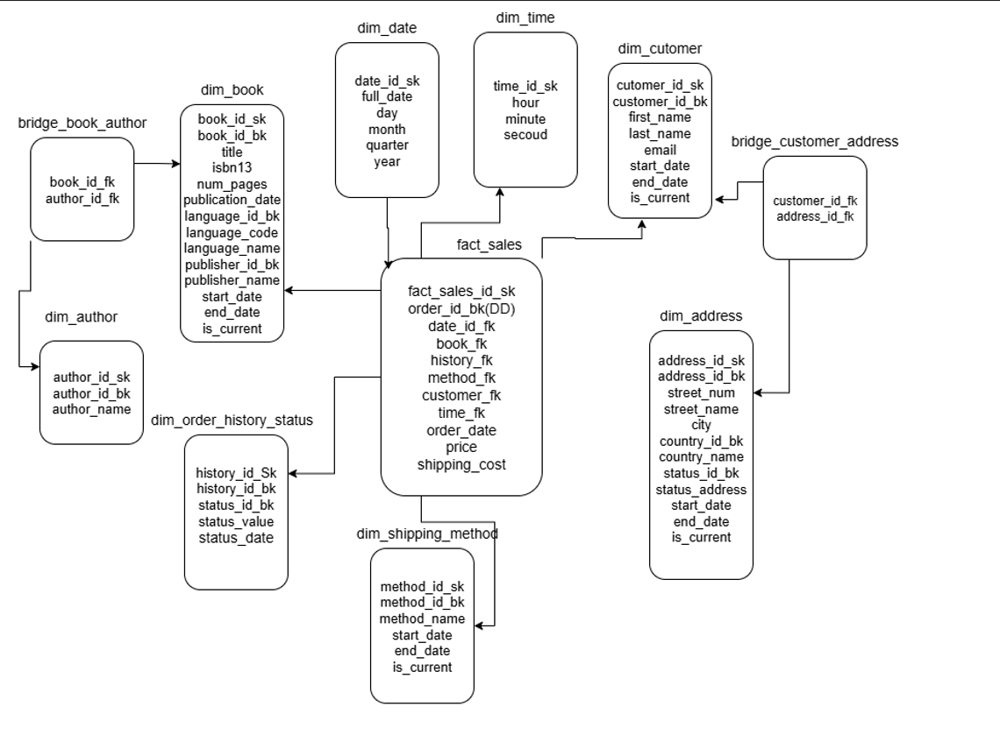
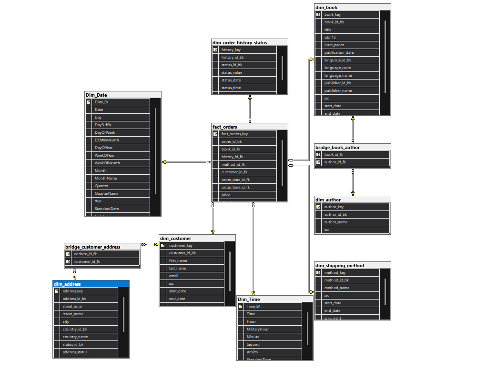

---

## 5. ETL Process (SSIS)  

The ETL process was implemented in **SSIS**, with a **dedicated package for each dimension, fact, and bridge table**.  
This modular approach simplifies development, testing, and maintenance.  

### 5.1 General ETL Flow  
1. **Extract:** Data pulled from the OLTP bookstore system.  
2. **Transform:**  
   - Clean and validate data.  
   - Generate surrogate keys.  
   - Handle NULLs using default "Unknown" records.  
   - Apply **SCD Type 2** for historical tracking.  
3. **Load:** Populate dimension, fact, and bridge tables.  

### 5.2 ETL Packages  

#### Dimension Packages  
- **Customer Dimension**  
 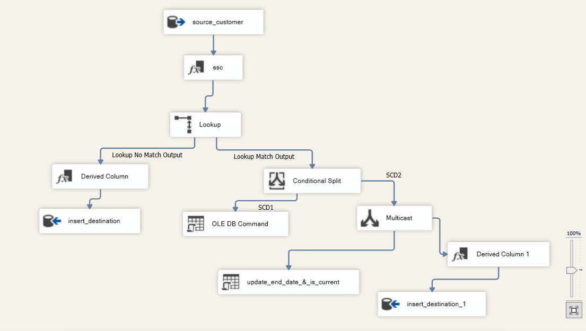
  *Figure 1: ETL package for `dim_customer` (SCD Type 2 implementation)*  

- **Book Dimension**  
   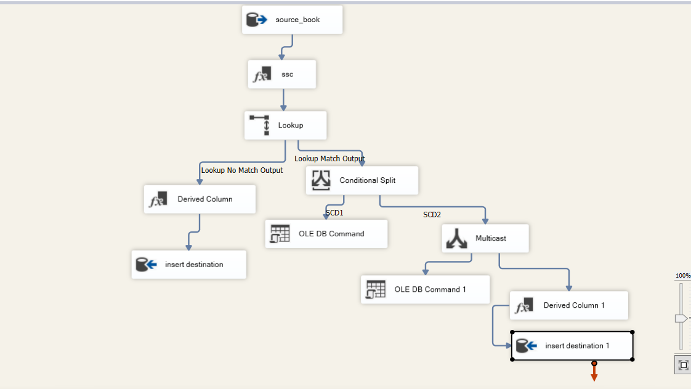 
  *Figure 2: ETL package for `dim_book` with publisher and language enrichment*  

- **Author Dimension**  
   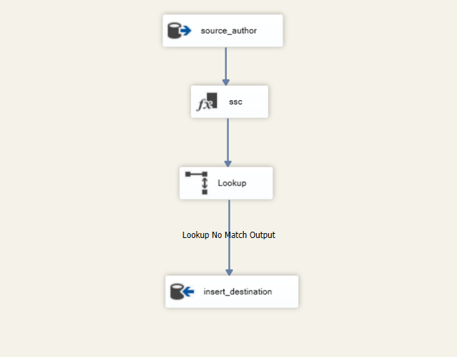 
  *Figure 3: ETL package for `dim_author`*  

- **Address Dimension**  
   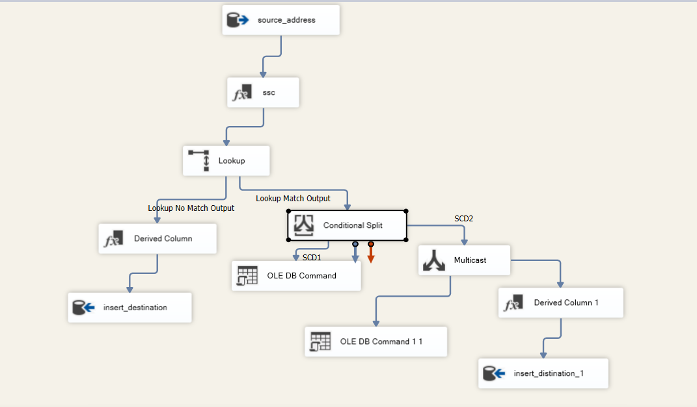
  *Figure 4: ETL package for `dim_address` with country and status join (SCD Type 2)*  

- **Shipping Method Dimension**  
   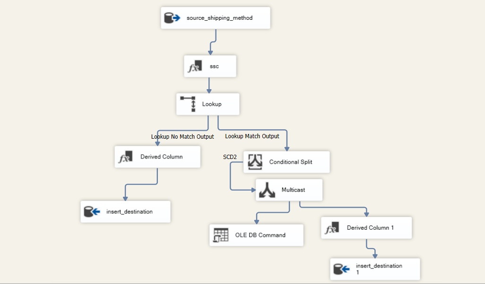  
  *Figure 5: ETL package for `dim_shipping_method` (SCD Type 2)*  

- **Order History Status Dimension**  
   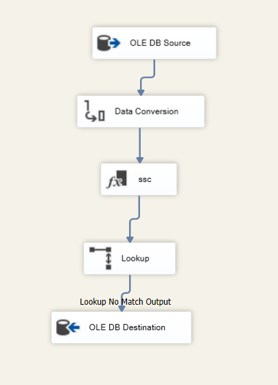  
  *Figure 6: ETL package for `dim_order_history_status`*  

#### Bridge Packages  
- **Book–Author Bridge**  
   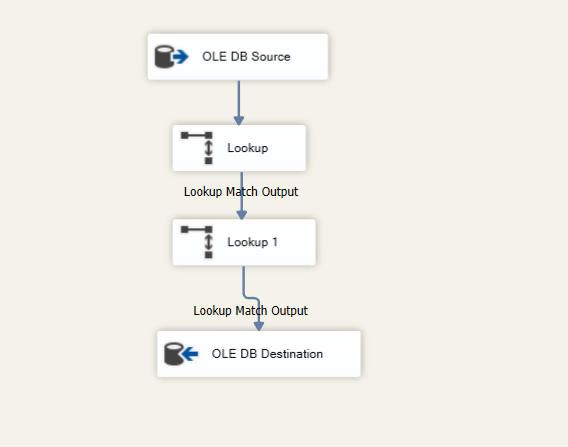  
  *Figure 7: ETL package for `bridge_book_author`*  

- **Customer–Address Bridge**  
   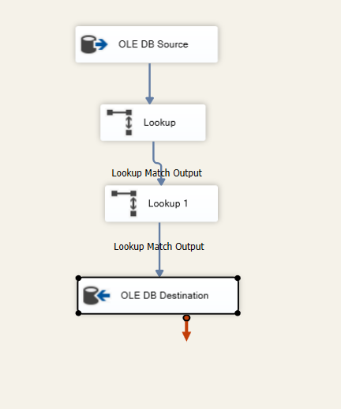  
  *Figure 8: ETL package for `bridge_customer_address`*  

#### Fact Package  
- **Fact Orders**  
  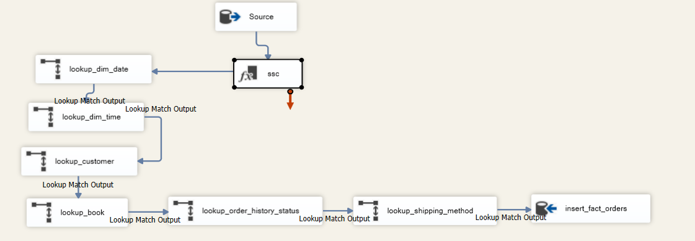
  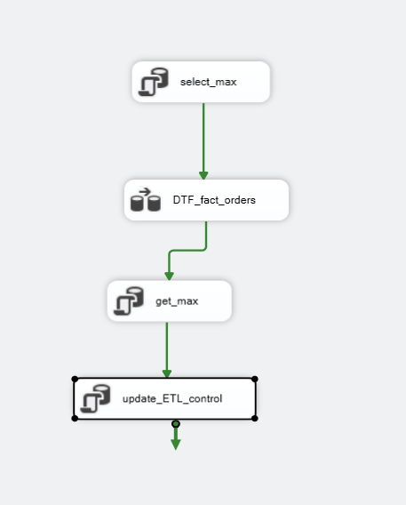
  *Figure 9: ETL package for `fact_orders`*  
  

---

## 6. Data Quality & Governance  

- **Surrogate Keys:** Ensures consistency across DWH.  
- **Unknown Handling:** `-1` keys for missing data.  
- **Constraints & FKs:** Maintain referential integrity.  
- **SCD Fields:** `start_date`, `end_date`, `is_current`.  

---

## 7. Analytics & Reporting  

The DWH powers **Power BI dashboards** with insights into:  
- **Sales Trends:** By book, author, and publisher.  
- **Customer Analytics:** Repeat buyers, top customers.  
- **Shipping & Delivery:** Cost breakdown, method performance.  
- **Order Lifecycle:** Status progression over time.  
- **Geographical Insights:** Sales by city and country.
- 
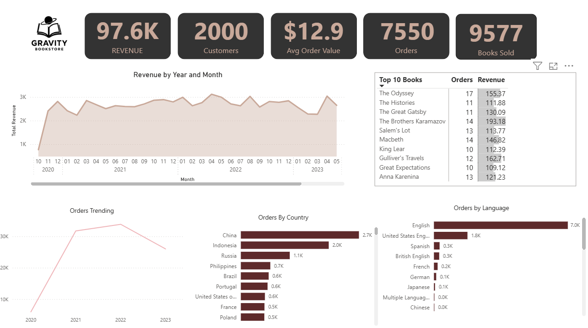
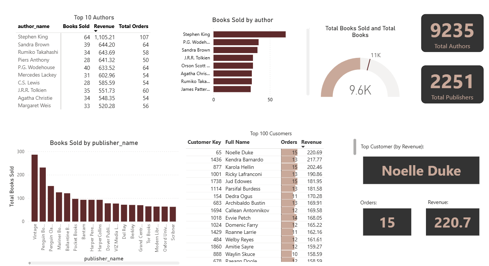
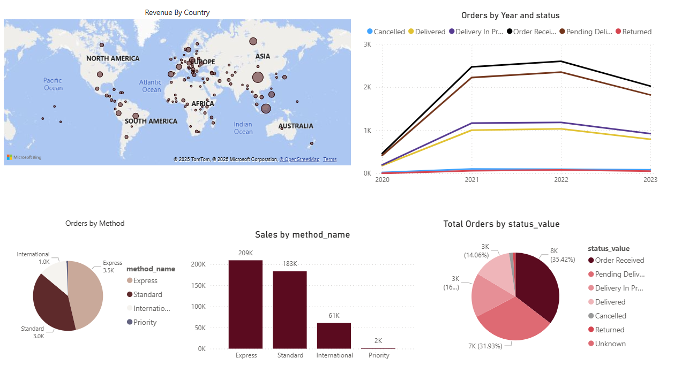
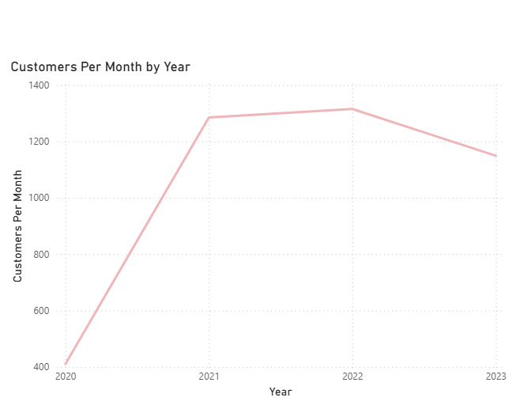

---

## 8. Repository Structure  

- `/Docs/Diagrams/` → ERD and architecture diagrams  
- `/Docs/Screenshots/` → ETL packages, dashboards, and process screenshots  
- `/SQL-Server/` → Data Warehouse DDL scripts (dimensions, facts, bridges)  
- `/BookStoreETL/` → SSIS packages (one per dimension, fact, and bridge)  
- `gravity_bookstore_dashboard.pbix` → Power BI dashboard file  
- `/README.md` → Project documentation  

